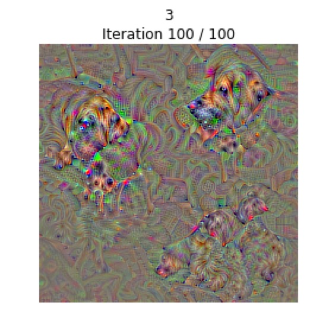

We trained ResNet18, and VGG16 on 15 Reddit dataset.

The ipynb file might be too big to show on the Git website, and we also uploaded the .py version.

The only thing need to run this code is to modify the paths of training and test dataset.

Visualization part (refer to CS231N HW3)

visualize_class.py can show the visualization results of each class.

To use it, weights of original network should be download, which can be obtained by res18.py and vgg.py.

